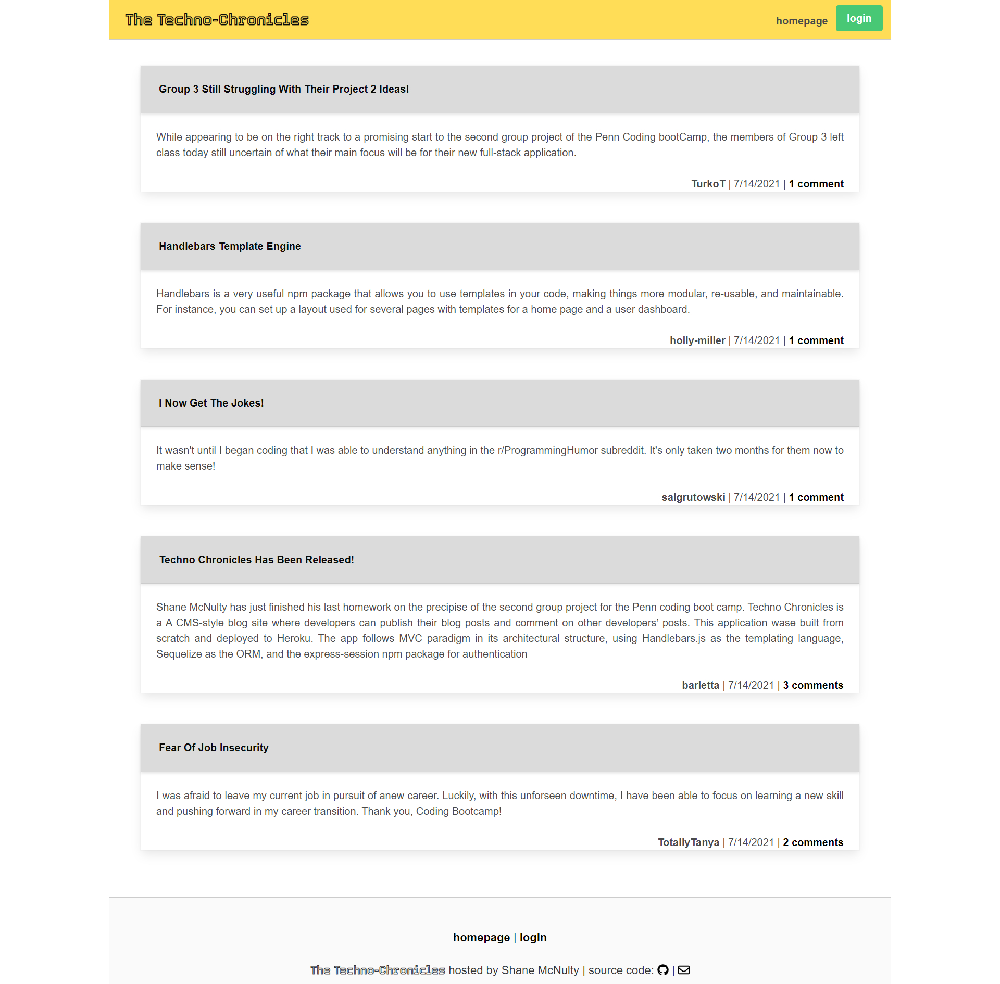

# MVC Tech Blog

## Description
'Techno Chronicles' is a CMS-style blog site that uses Model View Controller.  A mysql database is supporting the site and the application uses Express, Sequelize, Bulma, dotenv and Handlebars.  

### Table of Contents

- [Installation](#installation)
- [Usage](#usage)
- [Credits](#credits)
- [License](#license)

## Installation 

## Usage 
Click <a href="https://tech-blog--s.herokuapp.com/" target="_blank">here</a> to see the deployed site. 
 

[MVC Tech Blog Walkthrough](https://drive.google.com/file/d/1UDXPNPZX481FAe4EMzk604PRbR97PTkO/view)

## Guidelines

## Credits

## License

Licensed Under the 

## Badges

## Features

## How to Contribute

##### Please reach out via [email](mailto:mcnultyshanej@gmail.com) if there is any questions or if you would be interested in contributing to this project.
##### Github: [github.com/mcnultyshane](https://github.com/mcnultyshane)

## Tests